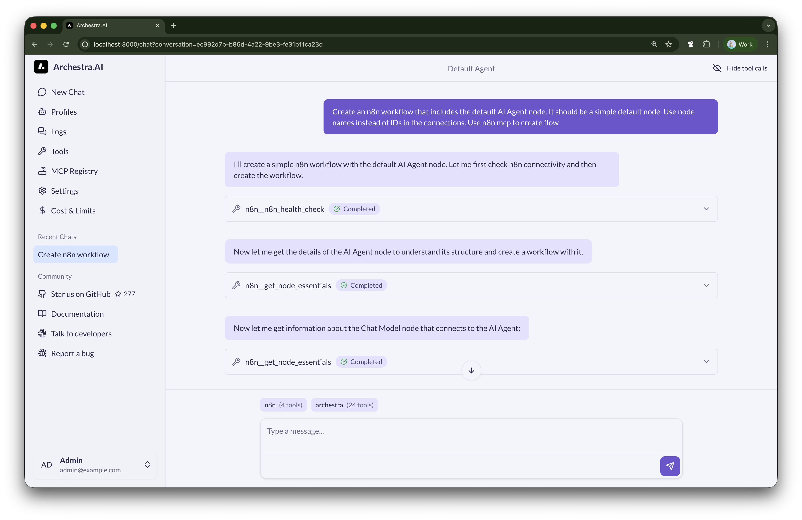
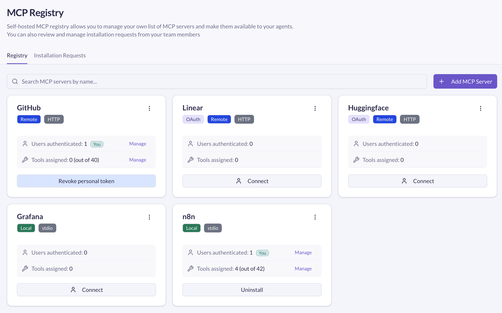
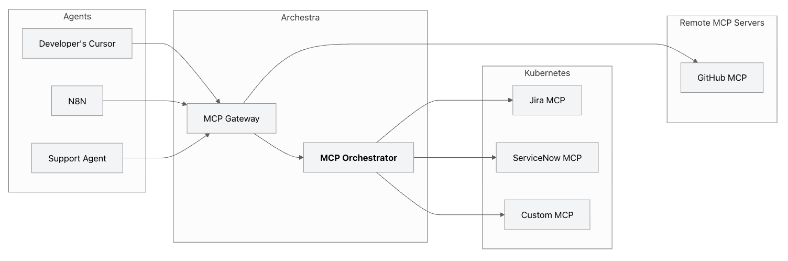
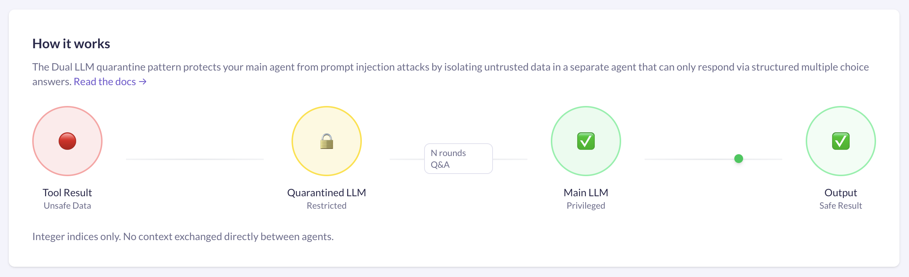
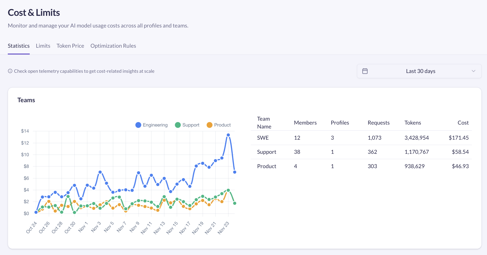
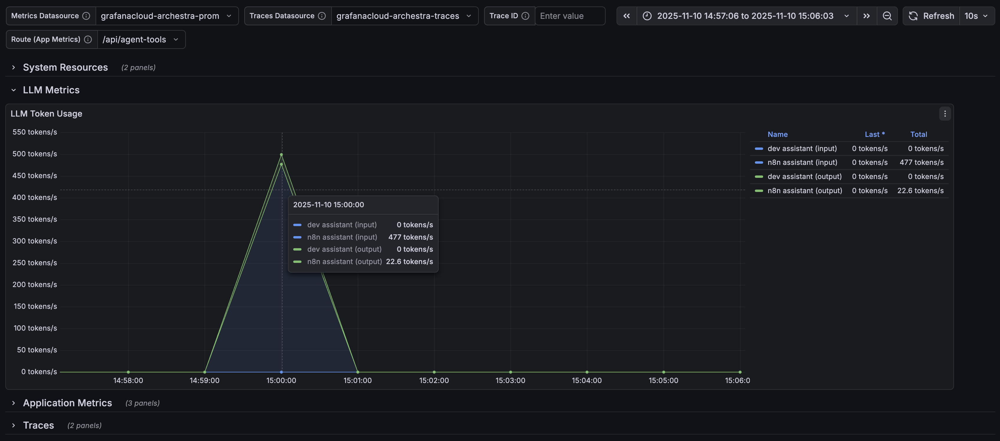

# MCP-native Secure AI Platform

Simplify AI usage in your company, providing user-friendly MCP toolbox, observability and control built on a strong security foundation.

<div align="center">

[](LICENSE)


[](https://github.com/archestra-ai/archestra/graphs/contributors)

<p align="center">
  <a href="https://www.archestra.ai/docs/platform-quickstart">Getting Started</a>
  - <a href="https://github.com/archestra-ai/archestra/releases">Releases</a>
  - <a href="https://join.slack.com/t/archestracommunity/shared_invite/zt-3d3ifjzg0-y2Z93cLLkZgRAooRpNu7ZA">Slack Community</a>
</p>
</div>

*For Platform teams:*
- Mitigate MCP chaos, move MCP servers from individual machines to a centralized orchestrator
- Manage how MCP access data and credentials usage
- Mitigate data exfiltration risks
- Manage AI costs
- AI Observability

*For Developers:*
- Deploy your MCP servers org-wide
- Build and deploy agents without worrying about security

*For Management:*
- Bring 1-click MCP adoption to the whole organization for technical and non-technical users
- Reduce AI costs up to 96%
- Get full visibility on AI adoption, usage and data access


## 🚀 Quickstart with docker

```
docker pull archestra/platform:latest;
docker run -p 9000:9000 -p 3000:3000 \
  -e ARCHESTRA_QUICKSTART=true \
  -v /var/run/docker.sock:/var/run/docker.sock \
  -v archestra-postgres-data:/var/lib/postgresql/data \
  -v archestra-app-data:/app/data \
  archestra/platform;
```

[Full Quickstart Guide →](https://archestra.ai/docs/platform-quickstart)


<picture>
  <source
    media="(prefers-color-scheme: dark)"
    srcset="
      https://api.star-history.com/svg?repos=archestra-ai/archestra&type=Date&theme=dark
    "
  />
  <source
    media="(prefers-color-scheme: light)"
    srcset="
      https://api.star-history.com/svg?repos=archestra-ai/archestra&type=Date
    "
  />
  
</picture>

## 👩‍💻 ChatGPT-like chat with MCPs

🎁 with private company-wide prompt registry!

<div align="center">

</div>

## 📋 Private MCP registry with governance

Add MCPs to your private registry to share them with your team: self-hosted and remote, self-built and third-party.

[Learn more about Private MCP Registry →](https://archestra.ai/docs/platform-private-registry)

<div align="center">

</div>

## ☁️ Kubernetes-native MCP orchestrator

Run MCP servers in kubernetes, managing their state, API keys, OAuth.

[Learn more about MCP Orchestrator →](https://archestra.ai/docs/platform-orchestrator)

<div align="center">

</div>

## 🤖 Security sub-agents

Isolating dangerous tool responses from the main agent to prevent prompt injections.

[Learn more about Dual LLM →](https://archestra.ai/docs/platform-dual-llm)

<div align="center">

</div>


## 🚫 Non-probabalistic security to prevent data exfiltration

Models could consume prompt injections via MCP uncontrollably (read your inbox, read your GitHub issues, read your customer's inquiries) and follow them resulting in data exfiltration.

[Learn more about Dynamic Tools →](https://archestra.ai/docs/platform-dynamic-tools) | [The Lethal Trifecta →](https://archestra.ai/docs/platform-lethal-trifecta) 

Live demo of archestra security engine preventing data leak from the private GitHub repo to the public repo:
[](https://www.youtube.com/watch?v=SkmluS-xzmM&t=2155s)

Read more: [Simon Willison](https://simonwillison.net/2025/Jun/16/the-lethal-trifecta/), [The Economist](https://www.economist.com/leaders/2025/09/25/how-to-stop-ais-lethal-trifecta)

Examples of hacks:
[ChatGPT](https://simonwillison.net/2023/Apr/14/new-prompt-injection-attack-on-chatgpt-web-version-markdown-imag/) (April 2023), [ChatGPT Plugins](https://simonwillison.net/2023/May/19/chatgpt-prompt-injection/) (May 2023), [Google Bard](https://simonwillison.net/2023/Nov/4/hacking-google-bard-from-prompt-injection-to-data-exfiltration/) (November 2023), [Writer.com](https://simonwillison.net/2023/Dec/15/writercom-indirect-prompt-injection/) (December 2023), [Amazon Q](https://simonwillison.net/2024/Jan/19/aws-fixes-data-exfiltration/) (January 2024), [Google NotebookLM](https://simonwillison.net/2024/Apr/16/google-notebooklm-data-exfiltration/) (April 2024), [GitHub Copilot Chat](https://simonwillison.net/2024/Jun/16/github-copilot-chat-prompt-injection/) (June 2024), [Google AI Studio](https://simonwillison.net/2024/Aug/7/google-ai-studio-data-exfiltration-demo/) (August 2024), [Microsoft Copilot](https://simonwillison.net/2024/Aug/14/living-off-microsoft-copilot/) (August 2024), [Slack](https://simonwillison.net/2024/Aug/20/data-exfiltration-from-slack-ai/) (August 2024), [Mistral Le Chat](https://simonwillison.net/2024/Oct/22/imprompter/) (October 2024), [xAI's Grok](https://simonwillison.net/2024/Dec/16/security-probllms-in-xais-grok/) (December 2024), [Anthropic's Claude iOS app](https://simonwillison.net/2024/Dec/17/johann-rehberger/) (December 2024), [ChatGPT Operator](https://simonwillison.net/2025/Feb/17/chatgpt-operator-prompt-injection/) (February 2025), [Notion 3.0](https://www.codeintegrity.ai/blog/notion) (September 2024).


## 💰 Cost monitoring, limits and dynamic optimization

Per-team, per-agent or per-org cost monitoring and limitations. Dynamic optimizer allows to reduce cost up to 96% by simply switching to cheaper models automatically for simpler tasks.

[Learn more about Costs & Limits →](https://archestra.ai/docs/platform-costs-and-limits) 

<div align="center">

</div>

## 📊 Observability

Metrics, traces and logs allowing to come to a conclusion about per-org, per-agent and per-team token and tool usage, and performance.

[Learn more about Observability →](https://archestra.ai/docs/platform-observability)

<div align="center">

</div>

## 👍 Ready for production

1. ✅ Lightning fast, 45ms at 95p: [Performance & Latency benchmarks →](https://archestra.ai/docs/platform-performance-benchmarks)
2. ✅ [Terraform provider →](https://github.com/archestra-ai/terraform-provider-archestra)
3. ✅ [Helm Chart →](https://archestra.ai/docs/platform-deployment#helm-deployment-recommended-for-production)

## 🤝 Contributing

We welcome contributions from the community! 

- [Contribution Guidelines →](https://archestra.ai/docs/contributing)
- [Developer Quickstart →](https://archestra.ai/docs/platform-developer-quickstart)
- [Security & Bug Bounty →](https://archestra.ai/docs/security)

Thank you for contributing and continuously making <b>Archestra</b> better, <b>you're awesome</b> 🫶

<a href="https://github.com/archestra-ai/archestra/graphs/contributors">
  
</a>

---

<div align="center">
  <br />
  <a href="https://www.archestra.ai/blog/archestra-joins-cncf-linux-foundation"></a>
  &nbsp;&nbsp;&nbsp;&nbsp;&nbsp;&nbsp;
  <a href="https://www.archestra.ai/blog/archestra-joins-cncf-linux-foundation"></a>
</div>
