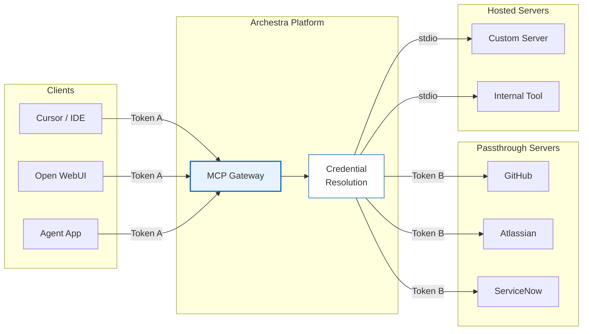
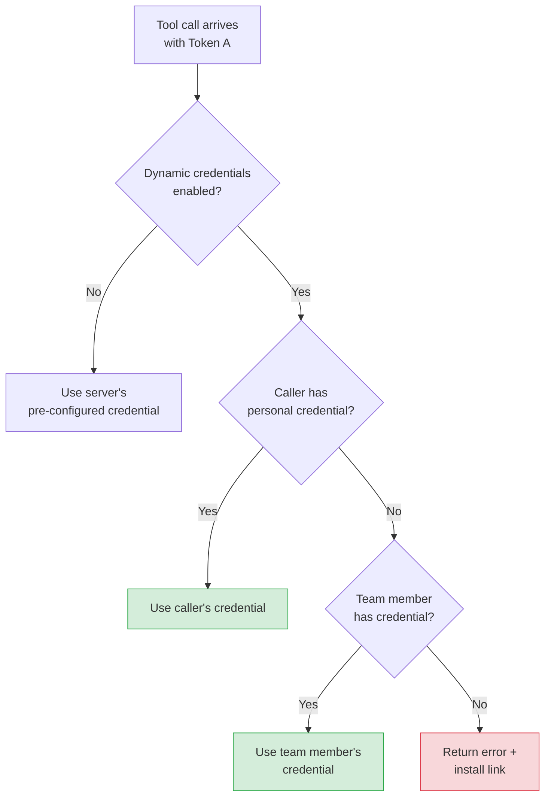

<!--
Check ../docs_writer_prompt.md before changing this file.
-->

Archestra's MCP Gateway handles authentication at two layers: it authenticates clients connecting to the gateway, and it separately manages credentials for the upstream MCP servers it orchestrates. Clients never see or handle upstream credentials directly.

## Gateway Authentication

The MCP Gateway supports two authentication methods for incoming client connections.

### OAuth 2.1

MCP-native clients such as Claude Desktop, Cursor, and Open WebUI authenticate automatically using the [MCP Authorization spec](https://modelcontextprotocol.io/specification/2025-11-25/basic/authorization). The gateway acts as both the resource server and the authorization server.

The gateway supports the following OAuth flows and client registration methods:

- **Authorization Code + PKCE**: The standard browser-based authorization flow. The user is redirected to a login and consent screen, and the client receives tokens upon approval.
- **DCR (RFC 7591)**: Clients can register dynamically at runtime by posting their metadata to `POST /api/auth/oauth2/register`. The gateway returns a `client_id` for subsequent authorization requests.
- **CIMD**: Clients can use an HTTPS URL as their `client_id`. The gateway fetches the client's metadata document from that URL, eliminating the need for a separate registration step.

Endpoint discovery is automatic. The gateway exposes standard well-known endpoints so clients can find the authorization and token URLs without any hardcoded configuration:
- `/.well-known/oauth-protected-resource` (RFC 9728)
- `/.well-known/oauth-authorization-server` (RFC 8414)

### Bearer Token

For direct API integrations, clients can authenticate using a static Bearer token with the header `Authorization: Bearer archestra_<token>`. Tokens can be scoped to a specific user, team, or organization. You can create and manage tokens in **Settings > Tokens**.

### External IdP JWKS

Identity Providers (IdPs) configured in Archestra can also be used to authenticate external MCP clients. When an IdP is linked to an Archestra MCP Gateway, the gateway validates incoming JWT bearer tokens against the IdP's JWKS (JSON Web Key Set) endpoint and matches the caller to an Archestra user account. The same team-based access control that applies to Bearer tokens and OAuth also applies here — the JWT's email claim must correspond to an Archestra user who has permission to access the gateway.

After authentication, the gateway propagates the original JWT to upstream MCP servers as an `Authorization: Bearer` header. This enables end-to-end identity propagation — upstream servers can validate the same JWT against the IdP's JWKS and extract user identity from the claims without any Archestra-specific integration. See [End-to-End JWKS](#end-to-end-jwks-without-gateway) below for how to build servers that consume these tokens.

#### How It Works

1. Admin configures an OIDC Identity Provider in **Settings > [Identity Providers](/docs/platform-identity-providers)**
2. Admin creates an MCP Gateway and selects the Identity Provider to use for JWKS Auth
3. External MCP client obtains a JWT from the IdP (e.g., via client credentials flow or user login)
4. Client sends requests to the gateway with `Authorization: Bearer <jwt>`
5. Gateway discovers the JWKS URL from the IdP's OIDC discovery endpoint
6. Gateway validates the JWT signature, issuer, audience (IdP's client ID), and expiration
7. Gateway extracts the `email` claim from the JWT and matches it to an Archestra user account
8. Gateway propagates the original JWT to upstream MCP servers

#### Requirements

- The Identity Provider must be an **OIDC provider** (SAML providers do not support JWKS)
- The IdP must expose a standard OIDC discovery endpoint (`.well-known/openid-configuration`) with a `jwks_uri`
- The JWT `iss` claim must match the IdP's issuer URL
- The JWT `aud` claim must match the IdP's client ID (if configured)
- The JWT must contain an `email` claim that matches an existing Archestra user
- The user must have `profile:admin` permission or be a member of at least one team associated with the gateway they are trying to use

## Upstream Credentials

MCP servers that connect to external services like GitHub, Atlassian, or ServiceNow need their own credentials. Archestra manages this with a two-token model:

- **Token A** authenticates the client to the gateway using either OAuth 2.1 or a Bearer token (described above).
- **Token B** authenticates the gateway to the upstream MCP server. This token is resolved and injected by Archestra at runtime.

The client only ever sends Token A. Archestra resolves Token B behind the scenes.

Credentials are configured when you install a server from the [MCP Catalog](/docs/platform-private-registry). There are two types of upstream credentials:

- **Static secrets**: API keys or personal access tokens that are set once at install time and used for all requests.
- **OAuth tokens**: Obtained by running an OAuth flow against the upstream provider during installation. Archestra stores both the access token and refresh token.

How credentials are delivered to the upstream server depends on the server type. For **passthrough** (remote) servers, Archestra sends the credential as an `Authorization: Bearer` header over HTTP. For **hosted** (local) servers running in Kubernetes, the gateway connects via stdio transport within the cluster and no auth headers are needed.

All credentials are stored in the secrets backend, which uses the database by default. For enterprise deployments, you can configure an [external secrets manager](/docs/platform-secrets-management).

### Per-User Credentials

By default, each MCP server installation has a single credential that is shared by all callers.

When you enable "Resolve at call time" on a server, Archestra resolves the credential dynamically based on the caller's identity. This enables multi-tenant setups where each developer uses their own GitHub PAT or each team member uses their own Jira access token.

When dynamic credentials are enabled, Archestra resolves them in priority order:

1. The calling user's own personal credential (highest priority)
2. A credential owned by a team member on the same team
3. If no credential is found, an error is returned with an install link

### Missing Credentials

When no credential can be resolved for a caller, the gateway returns an actionable error message that includes a direct link to install the MCP server with their own credentials:

> Authentication required for "GitHub MCP Server".
> No credentials found for your account (user: alice@company.com).
> Set up credentials: https://archestra.company.com/mcp-catalog/registry?install=abc-123

The user follows the link, installs the server with their credentials, and retries the tool call.

### Auto-Refresh

For upstream servers that use OAuth, Archestra handles the token lifecycle automatically. When the upstream server returns a 401, Archestra uses the stored refresh token to obtain a new access token and retries the request without any user intervention. Refresh failures are tracked per server and are visible in the MCP server status page.

## Building MCP Servers

There are three authentication patterns available for MCP servers deployed through Archestra, depending on whether the server needs external credentials and whether those credentials differ per user.

| Pattern | When to use | How it works |
|---|---|---|
| No auth | Internal tools with no external API dependencies | Hosted in K8s, gateway connects via stdio or streamable-http |
| Static credentials | Shared API key or service account | User provides credentials at install time, Archestra stores and injects them |
| OAuth 2.1 | Per-user access to a SaaS API | Full OAuth flow at install, automatic token refresh by Archestra |

### No Auth (Hosted)

For servers that don't call external APIs, no authentication is needed. The server runs in Archestra's Kubernetes cluster and the gateway connects to it via stdio or streamable-http transport. Since both the gateway and the server are in the same cluster, they share the same trust boundary. See [MCP Orchestrator](/docs/platform-orchestrator) for details on how hosted servers are managed.

### Static Credentials

For servers that need a shared API key or service token:

1. Define the required credential fields in the catalog entry (e.g., `JIRA_API_TOKEN`, `BASE_URL`)
2. Users provide the values when installing the server from the catalog
3. Archestra securely stores the credentials and passes them to the server at runtime

All tool calls through the gateway use the same credential.

### OAuth 2.1

For servers that connect to a SaaS API where each user has their own account (GitHub, Salesforce, etc.).

Your server (or its OAuth provider) needs to expose two things:
- A `/.well-known/oauth-protected-resource` endpoint that points to the authorization server
- A 401 response with a `WWW-Authenticate` header when tokens are missing or expired

Archestra handles everything else: endpoint discovery, client registration, the authorization code flow with PKCE, token storage, and automatic refresh when tokens expire.

Your server receives an `Authorization: Bearer <access_token>` header with each request from the gateway.

### End-to-End JWKS (Without Gateway)

When an MCP Gateway is configured with an [External IdP](#external-idp-jwks), the gateway propagates the caller's JWT to upstream MCP servers. Your MCP server receives the JWT as an `Authorization: Bearer` header and can validate it directly against the IdP's JWKS endpoint — statelessly, without any Archestra-specific integration.

This pattern is useful when your MCP server needs to enforce its own access control based on IdP claims (roles, groups, etc.), or when the server is also deployed outside of Archestra and needs to authenticate users independently.

See [Building Enterprise-Ready MCP Servers with JWKS and Identity Providers](https://archestra.ai/blog/enterprise-mcp-servers-jwks) for a full walkthrough with code examples.
