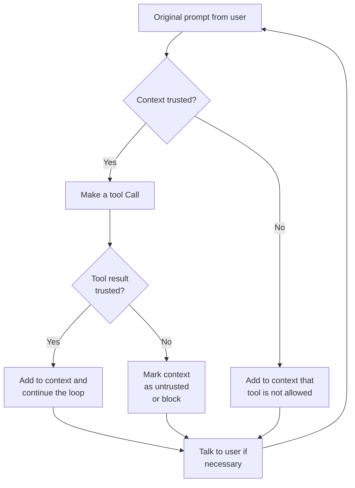

<!-- 
Check ../docs_writer_prompt.md before changing this file.

This document is human-built, shouldn't be updated with AI. Don't change anything here.

Exception:
- Screenshot
-->

Dynamic Tools feature af the Archestra Platform addresses the "lethal trifecta" by adapting agent capabilities based on trust levels, providing more flexibility than read-only or isolated systems.

This feature automatically restricts agent capabilities when untrusted content enters the context:

| 🚫 Unsafe Agent                  | 🟢 Safe Agent with **Dynamic Tools**                                               | 🟢 Safe Read-Only Agent          |
| -------------------------------- | ---------------------------------------------------------------------------------- | -------------------------------- |
| ✅ Can access private data       | ✅ Can access private data                                                         | ✅ Can access private data       |
| ✅ Can process untrusted content | ✅ Can process untrusted content                                                   | ✅ Can process untrusted content |
| ✅ Can communicate externally    | 🤖 External communication **dynamically disabled after processing untrusted data** | 🚫 Cannot communicate externally |

## Detect tools

The first step is to configure Archestra as a proxy for your agent's API requests. When your agent executes requests through the Archestra proxy endpoint, the platform automatically discovers and registers any tools included in those requests.

Tool discovery happens transparently:

1. Configure your agent to send requests through Archestra's proxy
2. When your agent makes API calls with tools, Archestra automatically detects them
3. Each tool's name, parameters, and description are extracted and stored
4. No manual tool registration or configuration required

This dynamic discovery allows Archestra to monitor and control tool usage without pre-configuration.

## Mark tools

Archestra uses **Trusted Data Policies** to identify which tool outputs should be considered safe. **By default, all data is untrusted** - only explicitly marked data becomes trusted.

When a tool returns data:

1. Archestra evaluates the output against all trusted data policies
2. If no policy matches, the data is marked as untrusted
3. The chat context becomes "tainted" when untrusted data enters
4. This taint status affects what tools can be invoked subsequently

Security enforcement flow:

1. When a tool is invoked, Archestra checks if the chat context is tainted
2. If tainted and no explicit allow policy exists, the tool is blocked
3. The agent receives a refusal message explaining the security violation
4. This prevents data exfiltration and unauthorized actions after processing untrusted content

This creates a dynamic security boundary - agents maintain full capabilities with trusted data but are automatically restricted when handling potentially malicious content.
