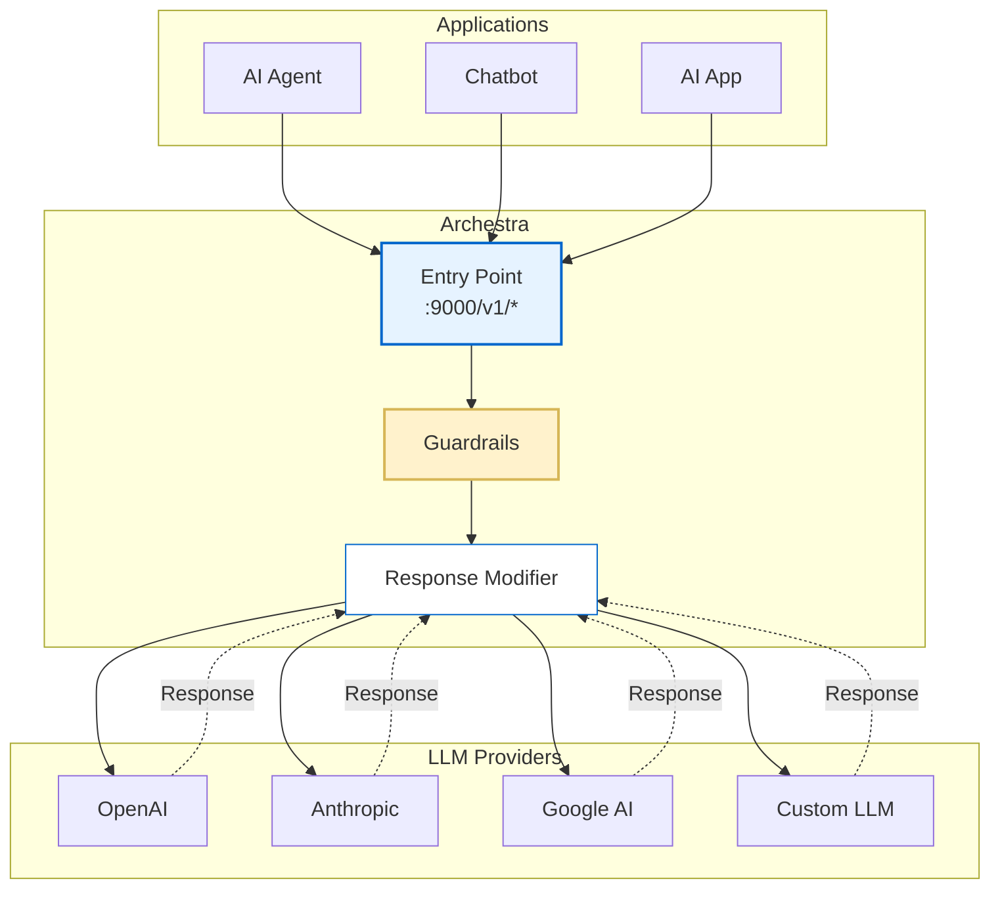

<!--
Check ../docs_writer_prompt.md before changing this file.

This document is human-built, shouldn't be updated with AI. Don't change anything here.

Exception:
- Screenshot
-->

LLM Proxy is Archestra's security layer that sits between AI agents and LLM providers (OpenAI, Anthropic, Google, etc.). It intercepts, analyzes, and modifies LLM requests and responses to enforce security policies, prevent data leakage, and ensure compliance with organizational guidelines.

## To use LLM Proxy:

1. Go to **LLM Proxies** and create a new proxy or use an existing one.
2. Click the **Connect** icon, choose the LLM provider you are using, and copy the provided URL.
3. Use this URL when calling your LLM provider instead of the provider's original endpoint.



## External Agent Identification

When multiple applications share the same [Profile](/docs/platform-profiles), you can use the `X-Archestra-Agent-Id` header to identify which application each request originates from. This allows you to:

- **Reuse a single Profile** across multiple applications while maintaining distinct tracking
- **Filter logs** by application in the LLM Proxy Logs viewer
- **Segment metrics** by application in your observability dashboards (Prometheus, Grafana, etc.)

### Usage

Include the header in your LLM requests:

```bash
curl -X POST "https://your-archestra-instance/v1/openai/chat/completions" \
  -H "Authorization: Bearer $OPENAI_API_KEY" \
  -H "X-Archestra-Agent-Id: my-chatbot-prod" \
  -H "Content-Type: application/json" \
  -d '{
    "model": "gpt-4",
    "messages": [{"role": "user", "content": "Hello!"}]
  }'
```

The external agent ID will be:

- **Stored** with each interaction in the database
- **Displayed** in the LLM Proxy Logs table (filterable)
- **Included** in Prometheus metrics as the `agent_id` label
- **Available** in the interaction detail page

### Example Use Cases

| Scenario              | Profile            | X-Archestra-Agent-Id                                |
| --------------------- | ------------------ | --------------------------------------------------- |
| Multiple environments | `customer-support` | `customer-support-prod`, `customer-support-staging` |
| Multiple applications | `shared-assistant` | `mobile-app`, `web-app`, `slack-bot`                |
| Per-customer tracking | `multi-tenant-bot` | `customer-123`, `customer-456`                      |

This approach lets you maintain centralized security policies through Profiles while still having granular visibility into which applications are generating traffic.

## User Identification

You can use the `X-Archestra-User-Id` header to associate LLM requests with a specific Archestra user. This is particularly useful for:

- **Tracking user activity** in the LLM Proxy Logs viewer
- **Identifying which user** made a request from the Archestra Chat
- **Auditing and compliance** purposes

### Usage

Include the header in your LLM requests with the Archestra user's UUID:

```bash
curl -X POST "https://your-archestra-instance/v1/openai/chat/completions" \
  -H "Authorization: Bearer $OPENAI_API_KEY" \
  -H "X-Archestra-User-Id: 123e4567-e89b-12d3-a456-426614174000" \
  -H "Content-Type: application/json" \
  -d '{
    "model": "gpt-4",
    "messages": [{"role": "user", "content": "Hello!"}]
  }'
```

### Archestra Chat Integration

When using the built-in Archestra Chat, the `X-Archestra-User-Id` header is automatically included in all requests, allowing you to see which team member initiated each conversation in the logs.
