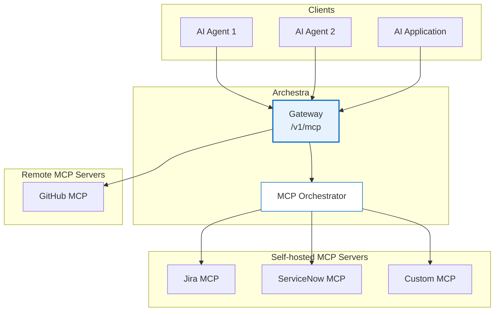

<!--
Check ../docs_writer_prompt.md before changing this file.

This document is human-built, shouldn't be updated with AI. Don't change anything here.

Exception:
- Screenshot
-->

MCP Gateway is the unified access point for all MCP servers in Archestra Platform. It provides a single endpoint through which AI agents and applications can discover and interact with multiple MCP servers, regardless of whether they are remote services or locally orchestrated containers.

## To use MCP Gateway:

1. Go to **MCP Registry** and make sure you have at least one MCP server installed.
2. Go to **MCP Gateways** and create a new gateway or use an existing one.
3. Click the pencil icon to open the **Edit MCP Gateway** form.
4. In the **Tools** section, assign MCP server tools to the MCP Gateway and save the changes by pressing **Update**.
5. Click the **Connect** icon to get connection instructions.

## Authentication

Archestra's MCP Gateways support three authentication methods:

- **OAuth 2.1** — MCP-native clients (Claude Desktop, Cursor, Open WebUI) authenticate automatically via the [MCP Authorization spec](https://modelcontextprotocol.io/specification/2025-11-25/basic/authorization). Supports both DCR and CIMD client registration.

- **Bearer Token** — For direct API integrations. Use `Authorization: Bearer archestra_<token>`. Tokens can be scoped to a user, team, or organization. Create tokens in **Settings → Tokens**.

- **External Identity Provider (JWKS)** — For MCP clients that authenticate with an external IdP (Keycloak, Okta, Entra ID, Auth0, etc.). The gateway validates JWT bearer tokens directly against the IdP's JWKS endpoint, allowing external users to access MCP tools without an Archestra account. Configure in **Settings → Identity Providers**, then select in the MCP Gateway's **Identity Provider (JWKS Auth)** dropdown.

See [MCP Authentication](/docs/mcp-authentication) for more details.
