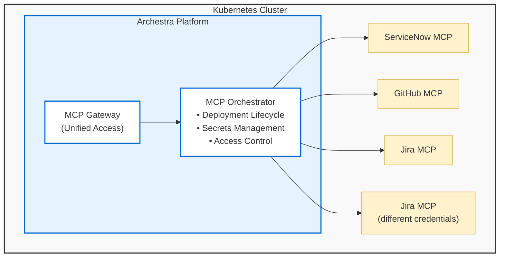

<!--
Check ../docs_writer_prompt.md before changing this file.

This document is human-built, shouldn't be updated with AI. Don't change anything here.

Exception:
- Screenshot
-->

The MCP Orchestrator is Archestra's system for running and managing MCP servers within your existing Kubernetes cluster. It handles the lifecycle of MCP server deployments, manages their secrets securely, and provides unified access through the MCP Gateway.

> **Note:** The MCP Orchestrator requires a Kubernetes (K8s) cluster to operate. You still could use Private MCP Registry, MCP Gateway and security features with remote MCP servers, or self-host them and connect to Archestra.

## How It Works

### Deployments

Each MCP server runs as a dedicated Kubernetes Deployment:

- **One Deployment Per Server**: Each MCP server gets its own isolated deployment
- **Automatic Lifecycle**: Deployments are automatically created, restarted, and managed
- **Custom Images**: Supports both standard and custom Docker images for MCP servers
- **Secret Management**: The orchestrator injects credentials and configuration

### Credentials

The orchestrator securely manages credentials for each MCP server. When you install a server from the [Private Registry](/docs/platform-private-registry), you authenticate with the external service — the resulting credential is stored and injected into the deployment at runtime.

Credentials can be **personal** (owned by a single user) or **team-scoped** (shared by all members of a team). When assigning tools to an MCP Gateway or Agent, you choose a specific credential or select "Resolve at call time" for dynamic per-user credential resolution.

> **Note:** For local MCP servers (running as K8s deployments), the "credential" is the deployment itself. The orchestrator routes tool calls to the correct deployment rather than injecting API tokens.

See [Authentication](/docs/mcp-authentication) for the full credential resolution logic, per-user credentials, and missing credential handling.
