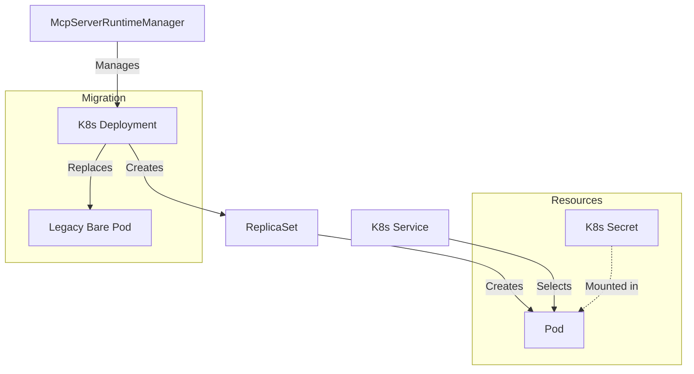

# MCP Server Runtime

The MCP Server Runtime manages the lifecycle of Model Context Protocol (MCP) servers within the Archestra platform. It is responsible for starting, stopping, and monitoring MCP servers, which run as Kubernetes resources when the Kubernetes runtime is enabled.

## Architecture

The runtime deploys each MCP server as a Kubernetes `Deployment`. This ensures high availability and allows Kubernetes to manage the pod lifecycle, including rescheduling during node upgrades or failures.

### Resource Hierarchy

For each MCP server, the following Kubernetes resources are created:

1.  **Deployment**: Manages the pod replicas (currently 1 replica per server).
2.  **Secret**: Stores sensitive environment variables (API keys, etc.).
3.  **Service**: (Optional) Created if the MCP server uses `streamable-http` transport, exposing the server's HTTP port.

### Migration

The runtime includes migration logic to automatically transition legacy "bare Pods" to Deployments. When starting an MCP server, it checks for an existing Pod with the same name. If a legacy Pod is found (one that is not managed by a ReplicaSet/Deployment), it is deleted before the new Deployment is created.

### Diagram

## Key Components

-   `McpServerRuntimeManager`: The main entry point, managing the collection of MCP servers.
-   `K8sDeployment`: Represents a single MCP server deployment, handling the specific K8s API interactions for that server.
-   `schemas.ts`: Zod schemas for runtime status and configuration.

## Configuration

The runtime is configured via the `config` module, which loads settings from environment variables (e.g., `ARCHESTRA_ORCHESTRATOR_KUBECONFIG`).
